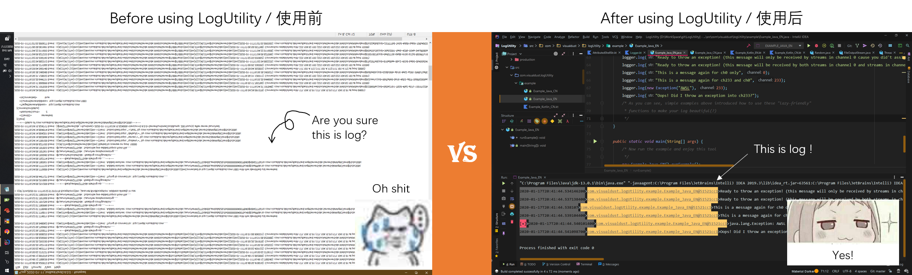

  
  
 
  
 
---

## Introduction / 简介  
`English` I take it you've made great effort while reading the long-complex-meaningless log produced by your terrible code. But listen, there is an easy way to make your log more BEAUTIFUL.  
`简体中文` 我猜你在阅读你可怕的代码所产生的冗长而毫无意义的日志时付出了很大的努力。但是，偷偷告诉你，有一种简单的方法可以使您的日志更加美观。

`English` Have a quick glance on an example and get a quick start:  
     

 `简体中文` 稍微看一下使用样例便能快速开始 :  
    