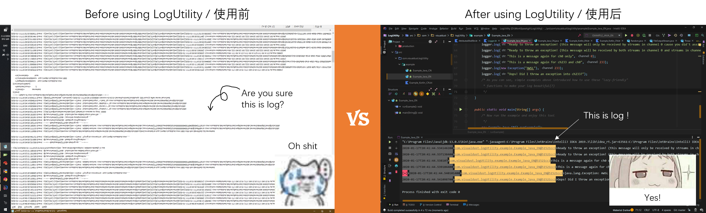

  
 [](https://github.com/VisualDust) 
 [](VisualDust@outlook.com)
  
 
---

## Introduction / 简介  
`English` I take it you've made great effort while reading the long-complex-meaningless log produced by your terrible code. But listen, there is an easy way to make your log more BEAUTIFUL.  
`简体中文` 我猜你在阅读你可怕的代码所产生的冗长而毫无意义的日志时付出了很大的努力。但是，偷偷告诉你，有一种简单的方法可以使您的日志更加美观。



---

## Why and where / 为什么用,在哪用  
`English` See if this expression is familiar with your code:  
```java
try{...}catch(Exception e){
System.out.println(LocalDateTime.now()+"Here comes an error on line 298:");
e.printStackTrace();}
```  
Or something just like this:  
```java
File file = new File("Log.txt");
new FileOutputStream(file).Write("xxx occurred when"+LocalDateTime.now());
```  
Sure thing that everyone was fooling on their logs as lazy as possible. But what if there is one way to make you log formatted perfectly and easy to read?  
Continue to read to find if it's just for lazy you. 
 
 ---

`简体中文` 查看此表达式是否在你的代码中很常见：  
```java
try{...}catch(Exception e){
System.out.println(LocalDateTime.now()+"Here comes an error on line 298:");
e.printStackTrace();}
```  
或类似这样的东西：  
```java
File file = new File("Log.txt");
new FileOutputStream(file).Write("xxx occurred when"+LocalDateTime.now());
```  
可以肯定的是，每个人都曾很随便地糊弄过自己的代码运行时输出以及产生的日志。 但是，如果有一种方法可以使您的日志格式完美且易于阅读呢?
继续阅读以发现它是否的确是为同样懒惰的你准备的。

---

## Feature / 功能特点

`English`  
- [x] Light weight and easy to use 
- [x] No need to worry about io problems
- [x] Mutiple output stream is supported
- [x] Behave like a broadcaster and easy to classify
- [x] Looks good with color in both terminal and log files
- [X] Separated debug infomation and log

`简体中文`  
- [x] 轻量级并且易用
- [x] 无需担心io问题
- [x] 支持多个输出流
- [x] 输出log表现地像是广播，易于分类
- [x] 终端和日志文件中的颜色看起来都不错
- [X] 调试信息与日志可分离

---

## Getting start / 快速上手

`English` Have a quick glance on an example and get a quick start:  
 [](https://github.com/visualDust/LogUtility/blob/master/src/com/visualdust/logUtility/example/Example_Java_EN.java) [](https://github.com/visualDust/LogUtility/blob/master/src/com/visualdust/logUtility/example/Example_Kotlin_EN.kt)   

 `简体中文` 稍微看一下使用样例便能快速开始 :  
  [](https://github.com/visualDust/LogUtility/blob/master/src/com/visualdust/logUtility/example/Example_Java_EN.java) [](https://github.com/visualDust/LogUtility/blob/master/src/com/visualdust/logUtility/example/Example_Kotlin_EN.kt)  

  ---

  ## Documentation / 文档  
  OOPS! I haven't write yet....  
  哎呀!我忘记写了...